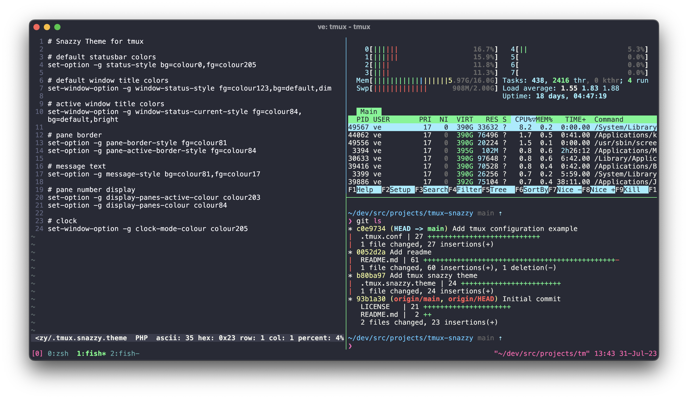

# tmux-snazzy

> Elegant [tmux](https://github.com/tmux/tmux) theme with bright colors. Inspired by the [hyper-snazzy](https://github.com/sindresorhus/hyper-snazzy) theme.



## Install

1. First, download this file:

    ```sh
    curl -o ~/.tmux.snazzy.theme https://raw.githubusercontent.com/ivnvxd/tmux-snazzy/main/.tmux.snazzy.theme
    ```

2. Add this line to the bottom of your `~/.tmux.conf`:

    ```sh
    source-file ~/.tmux.snazzy.theme
    ```

3. Reload your TMUX environment with: `tmux source-file ~/.tmux.conf`

## Tip

To get the same look as in the screenshot, you need to use the [Pure](https://github.com/sindresorhus/pure) prompt and Menlo font.

## Color translation:
- Background: #282a36 -> colour17
- Foreground: #eff0eb -> colour231
- Red: #ff5c57 -> colour203
- Green: #5af78e -> colour84
- Yellow: #f3f99d -> colour229
- Blue: #57c7ff -> colour81
- Magenta: #ff6ac1 -> colour205
- Cyan: #9aedfe -> colour123

## Related

- [hyper-snazzy](https://github.com/sindresorhus/hyper-snazzy) - Hyper version
- [iterm2-snazzy](https://github.com/sindresorhus/iterm2-snazzy) - iTerm2 version
- [terminal-snazzy](https://github.com/sindresorhus/terminal-snazzy) - Terminal version
- [konsole-snazzy](https://github.com/miedzinski/konsole-snazzy) - Konsole version
- [vscode-snazzy](https://github.com/Tyriar/vscode-snazzy) - VS Code version
- [emacs-snazzy](https://github.com/weijiangan/emacs-snazzy) - Emacs version
- [termite-snazzy](https://github.com/kbobrowski/termite-snazzy) - Termite version
- [deepin-snazzy](https://github.com/xxczaki/deepin-snazzy) - Linux Deepin terminal version
- [vim-snazzy](https://github.com/connorholyday/vim-snazzy) - Vim version
- [snazzybuddy.nvim](https://github.com/bbenzikry/snazzybuddy.nvim) - Neovim version
- [base16-snazzy](https://github.com/h404bi/base16-snazzy-scheme) - Base16 version
- [kitty-snazzy](https://github.com/connorholyday/kitty-snazzy) - Kitty version
- [gnome-terminal-snazzy](https://github.com/tobark/hyper-snazzy-gnome-terminal) - Gnome terminal version
- [urxvt-snazzy](https://github.com/LeonGr/urxvt-snazzy) - Urxvt version
- [alacritty-snazzy](https://github.com/alebelcor/alacritty-snazzy) - Alacritty version
- [st-snazzy](https://github.com/Dko1905/st-snazzy) - Simple Terminal version
- [tilix-snazzy](https://github.com/clrxbl/tilix-snazzy) - Tilix version
- [terminus-snazzy](https://github.com/ThibzR/terminus-snazzy) - Terminus version
- [windows-terminal-snazzy](https://github.com/Richienb/windows-terminal-snazzy) - Windows Terminal version
- [warp-snazzy](https://github.com/GrimLink/warp-theme-snazzy) - Warp version

## License

MIT © [Andrey Ivanov](https://github.com/ivnvxd)
